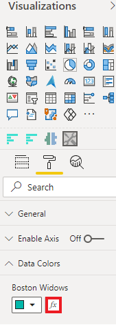

# Adding conditional formatting to your Visual 
[Conditional formatting](https://docs.microsoft.com/en-us/power-bi/visuals/service-tips-and-tricks-for-color-formatting#conditional-formatting-for-visualizations) of custom formatting properties is supported by updating formatting property object's in `getFormattingModel` method.

Conditional formatting can only be applied to the following property types:
* Color
* Text
* Icon
* Web URL

## Add a conditional color formatting entry in the format pane
To add the conditional color formatting button in the format pane for the desired object, under the `getFormattingModel` method, make the following change:

Define `instanceKind` property of required formatting property `descriptor` with the appropriate value.
Use `VisualEnumerationInstanceKinds` enum to declare the type of the desired format (constant, rule or both). 

```typescript
// List your conditional formatting properties
instanceKind: powerbi.VisualEnumerationInstanceKinds.ConstantOrRule
```


## Define how conditional formatting behaves
Using `createDataViewWildcardSelector` declared under `powerbi-visuals-utils-dataviewutils`, specify whether conditional formatting will be applied to instances, totals, or both. For more information, see [DataViewWildcard](https://docs.microsoft.com/en-us/power-bi/developer/visuals/utils-dataview#dataviewwildcard).

In `BarChartFormattingSettingsModel`, make the following changes to the formatting properties you want to apply conditional formatting to:

* Replace the formatting property `descriptor`'s `selector` value with a `dataViewWildcard.createDataViewWildcardSelector()` call. Specify the desired option from `DataViewWildcardMatchingOption` enum to define whether conditional formatting is applied to instances, totals, or both.

* Add the `altConstantValueSelector` property having the value previously defined for the `selector` property.

```typescript
// Define whether the conditional formatting will apply to instances, totals, or both
selector: dataViewWildcard.createDataViewWildcardSelector(dataViewWildcard.DataViewWildcardMatchingOption.InstancesAndTotals),

// Add this property with the value previously defined for the selector property
altConstantValueSelector: barDataPoint.selectionId.getSelector()
```
See [commit](https://github.com/Microsoft/PowerBI-visuals-sampleBarChart) for how conditional formatting was applied to sample bar chart.

