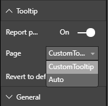

# Adding Report Page Tooltips support to Bar Chart
Report page tooltips support can be done by updating your visual capabilities.
See [commit](https://github.com/Microsoft/PowerBI-visuals-sampleBarChart/commit/3c6e8186436b63bf0cf97d2cdd5dde8aa8d08709) for what was added at this step.

To add report page tooltips support, most changes will be located in `capabilities.json`. A sample schema is already in place for you.

Report page tooltips definition can be done on the field well.



## Support Canvas Tooltips
To support displaying report page tooltips, add "tooltips" capability to capabilities.json as follows

```json
"tooltips": {
        "supportedTypes": {
            "default": true,
            "canvas": true
        },
        "roles": [
            "tooltips"
        ]
}
```

`supportedTypes` is the tooltips configurations supported by the visual and reflected on the field well.
    `default` instructs whether the "automatic" tooltips binding via data field is supported.
    `canvas` instructs whether the report page tooltips are supported.

`roles` optional. Once defined, instructs what data roles will be tied to the selected tooltip option in field well.


For more information, see the Report Page Tooltips usage guidlines [Report Page Tooltips](https://powerbi.microsoft.com/en-us/blog/power-bi-desktop-march-2018-feature-summary/#tooltips).

## Applying report page tooltips
On call to SandboxVisualHostTooltipService.Show() (or SandboxVisualHostTooltipService.Move())  PowerBI host will use 'identities' property of powerbi.extensibility.TooltipMoveOptions object sent to the call to get the  selectionId for which report page tooltip should be applied.

Example of how to send the selectionId to tooltip display calls:


